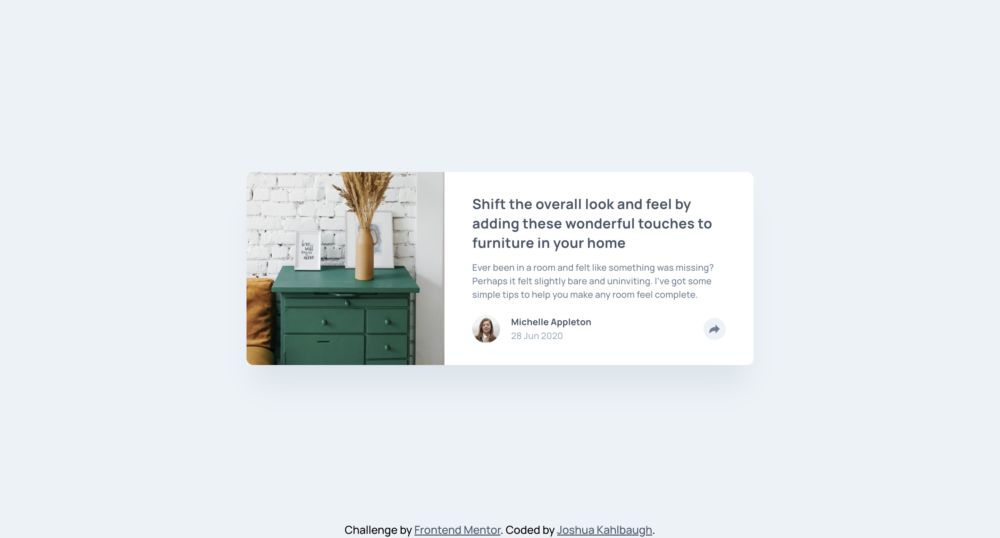

# Frontend Mentor - Article preview component solution

This is a solution to the [Article preview component challenge on Frontend Mentor](https://www.frontendmentor.io/challenges/article-preview-component-dYBN_pYFT). Frontend Mentor challenges help you improve your coding skills by building realistic projects.

## Table of contents

-   [Overview](#overview)
    -   [The challenge](#the-challenge)
    -   [Screenshot](#screenshot)
    -   [Links](#links)
-   [My process](#my-process)
    -   [Built with](#built-with)
    -   [What I learned](#what-i-learned)
    -   [Continued development](#continued-development)
    -   [Useful resources](#useful-resources)
-   [Author](#author)

## Overview

### The challenge

Users should be able to:

-   View the optimal layout for the component depending on their device's screen size
-   See the social media share links when they click the share icon

### Screenshot



### Links

-   Solution URL: [Solution URL](https://github.com/Joshk7/article-preview)
-   Live Site URL: [Live Site URL](https://article-preview-orpin.vercel.app)

## My process

I first started with developing the mobile design and then switched to desktop. Once I had both mobile and desktop pretty well styled, I tried to style the popup elements and then set them to display none. Then, I attached a JavaScript to my html via a script tag to make the share button set a popup to display: flex depending on a media query to get respective popups based on mobile or desktop designs.

### Built with

-   Semantic HTML5 markup
-   CSS custom properties
-   Flexbox
-   CSS Grid
-   Mobile-first workflow

### What I learned

I learned that I can match media queries in css files with javascript using the window.matchMedia function. I used this so that the proper popup would be displayed when I press the share icon on different screens.

```javascript
const mediaQuery = window.matchMedia("(min-width: 55rem)");
```

Also, I had a hard time trying to fix a small bug where the top of the card would cut off so the top of he image of the sidetable wouldn't be visible. My problem was that the main flex container holding the card in place was centered in such a way that applying overflow: visible wouldn't work. The solution was to add margin to the top and bottom of the card so it would always be within the viewport.

```css
main {
    height: 100%;
    display: flex;
    justify-content: center;
}

.card {
    margin-block: auto;
    max-width: 20.4375rem;
}
```

### Continued development

I can continue working on the styles of the popups so that they have proper box shadow. Any tips on how to apply box shadow to the triangle part of the desktop popup would be helpful.

### Useful resources

-   [JavaScript event handlers](https://www.freecodecamp.org/news/dom-events-and-javascript-event-listeners/) - This was a great refresher on JavaScript event handlers.

## Author

-   Website - [Joshua Kahlbaugh](https://joshuakahlbaugh.pages.dev)
-   Frontend Mentor - [@Joshk7](https://www.frontendmentor.io/profile/Joshk7)
